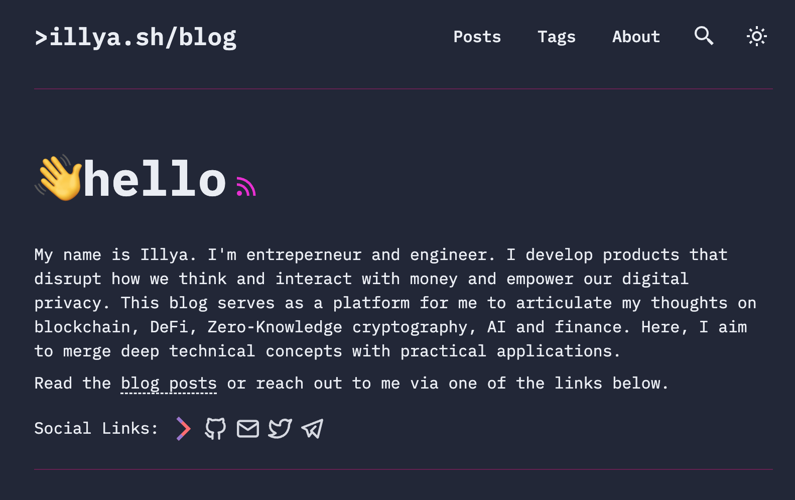

# > illya.sh/blog/

## 👋hello

My name is <a href="https://illya.sh">Illya</a>. I'm entreperneur and engineer. I develop products that disrupt how we think and interact with money and empower our digital privacy. This blog serves as a platform for me to articulate my thoughts on blockchain, DeFi, Zero-Knowledge cryptography, AI and finance. Here, I aim to merge deep technical concepts with practical applications.

This is the source code for my blog, [>illya.sh/blog/](https://illya.sh/blog/).

Read the blog posts or reach out to me via one of the links below:

- [>illya.sh](https://illya.sh/) - my homepage, where you can find about what I am currently developing and find contact information
- [twitter.com/iluxonchik](htpts://twitter.com/iluxonchik/) - my Twitter/X, where I post about blockchain, DeFi, Zero-Knowledge cryptography, AI and finance

## 📜 License

Original theme forked from [astro-paper](https://github.com/satnaing/astro-paper).

Licensed under the MIT License, Copyright © 2023

---
